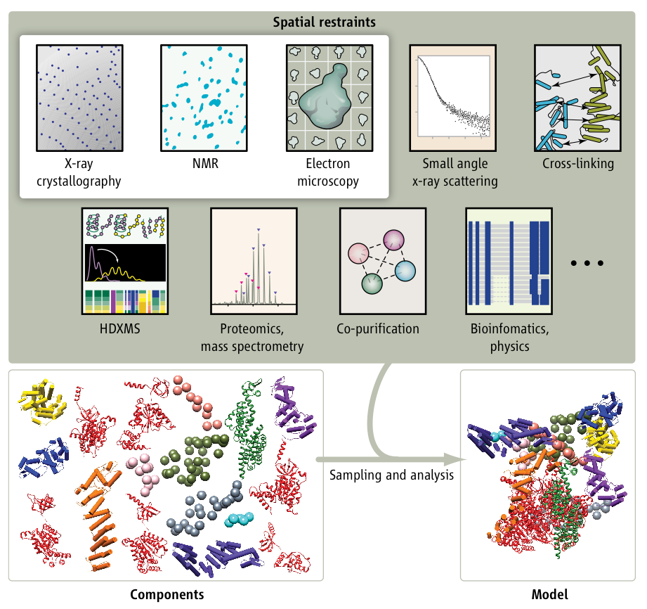
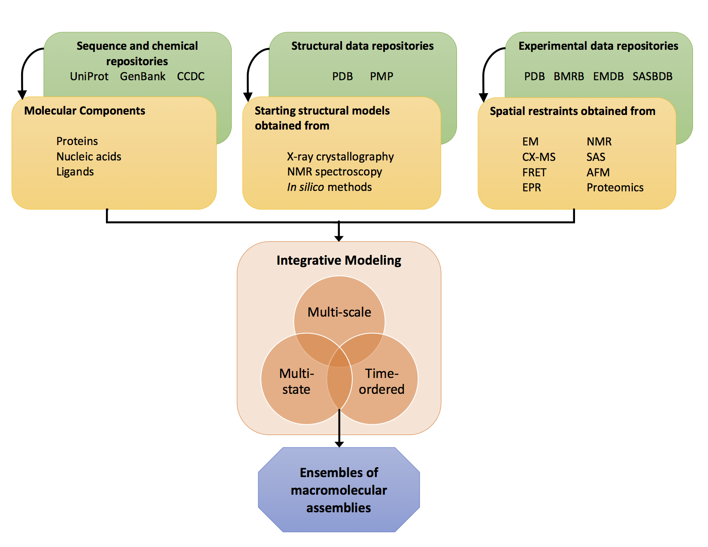
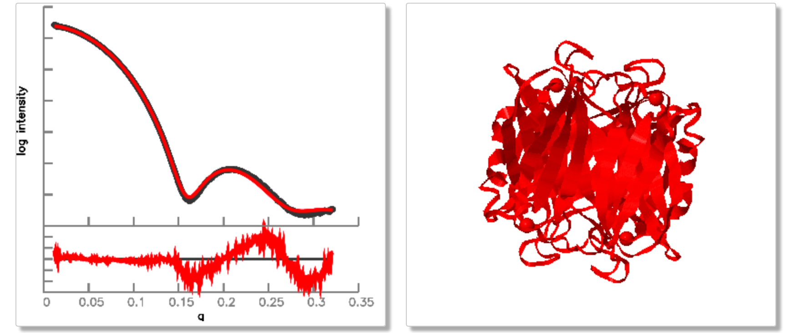
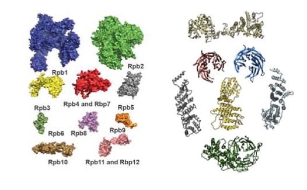
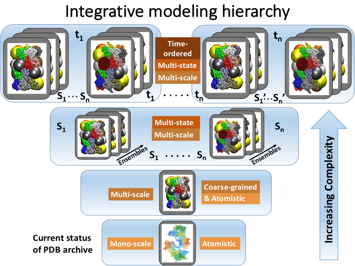
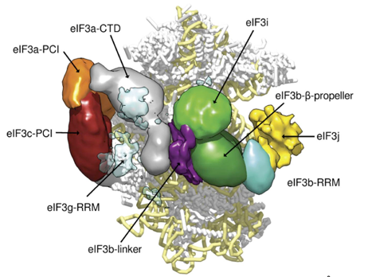
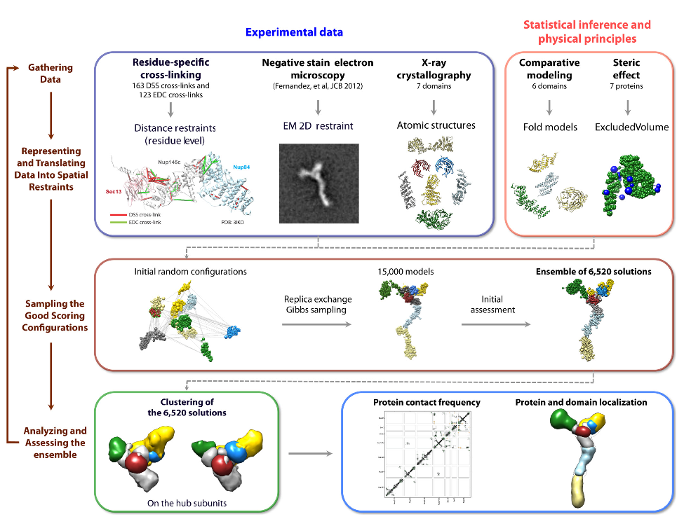
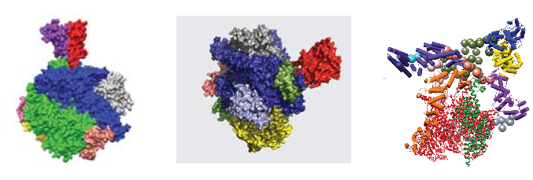
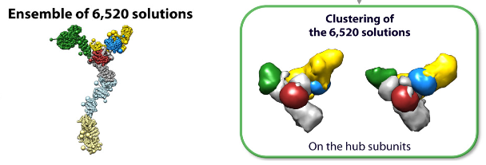

## Integrative/hybrid methods extension dictionary

### Introduction

The structures of many complex macromolecular assembles are obtained
through integrative/hybrid (I/H) methods. These methods involve a 
combination of complementary methods, both experimental and computational, 
that provide information on different aspects of the assembly that
can be integrated to obtain a structural view of the complex biological 
machinery. The models obtained through integrative/hybrid methods 
are more complex than the traditional structural models archived in the 
Protein Data Bank (PDB) that are obtained from a single method such as 
X-ray crystallography, NMR spectroscopy or electron microscopy. We aim to
create an archive for integrative/hybrid methods and 
propose to extend the existing PDBX/mmCIF dictionary to accommodate 
the requirements for integrative models. 

*Figure 1. Integrative modeling of a complex macromolecular assembly utilizes spatial restraints 
dervied from a variety of experiments along with available structural data of individual components 
to drive an extensive computational sampling and analysis leading to the structural characterization 
of the assembly.*

### PDBX/mmCIF dictionary extension

The PDBX/mmCIF dictionary is currently used by the Protein Data Bank
to archive structural models of biologcal macromolecules. The details
of the dictionary and the corresponding documentataion can be obtained 
from the [wwpdb mmCIF dictionary website](http://mmcif.wwpdb.org). 
The documention on the
[dictionary file syntax](http://mmcif.wwpdb.org/docs/tutorials/mechanics/pdbx-mmcif-syntax.html),
[dictionary organization](http://mmcif.wwpdb.org/docs/tutorials/mechanics/pdbx-mmcif-dict-struct.html),
[atomic description](http://mmcif.wwpdb.org/docs/tutorials/content/atomic-description.html) and 
[molecular description](http://mmcif.wwpdb.org/docs/tutorials/content/molecular-entities.html) 
are especially recommended. 

An [extension to the existing PDBX/mmCIF dictionary](https://github.com/salilab/mmcif/blob/master/ihm-extension.dic) 
has been created to capture the complex details involved in generating integrative/hybrid models. 
The figure below provides a high-level illustration of the content areas incorporated in the 
I/H methods extension dictionary.
 

*Figure 2. Illustration of the data content captured in the IHM dictionary extension.* 

The I/H methods extension dictionary describes the different kinds of input data types used in integrative modeling. 
These include the following. 

 - Description of the molecular components in the macromolecular assembly such as 
proteins, nucleic acids and ligands. The primary sequence of proteins and nucleic acids, 
the identities and chemical composition of the ligands and the number of copies of each 
of these molecular components, follow from the corresponding definitions in the 
[PDBx/mmCIF dictionary](http://mmcif.wwpdb.org/). These data items are obtained from the 
respective sequence and chemical repositories such as [UniProt](http://www.uniprot.org/), 
[GenBank](http://www.ncbi.nlm.nih.gov/genbank/) and the Cambridge Crystallographic Data 
Center, [CCDC](http://www.ccdc.cam.ac.uk/) and are referenced accordingly in the dictionary. 

 - The starting structural models of individual molecular components can be obtained from 
experimental methods such as X-ray crystallography and NMR spectroscopy or from *insilico* 
methods such as comparative and *abinitio* modeling. These starting models are obtained 
from the respective structural data repositories such as the Protein Data Bank, [PDB](http://www.rcsb.org/) 
and the [model archive](http://www.modelarchive.org/) at the Protein model portal, 
[PMP](http://www.proteinmodelportal.org/), and are referenced accordingly in the dictionary.

 - The input spatial restraints used in integrative modeling can be derived from various 
experimental methods such as electron microscopy (EM), nuclear magnetic resonance spectroscopy (NMR), 
cross-linking mass spectrometry (CX-MS), small angle solution scattering (SAS), 
Forster resonance energy transfer (FRET), atomic force microscopy (AFM), 
electron paramagnetic resonance spectroscopy (EPR) and various other proteomics methods 
such as affinity purification, co-purification etc. These categories further account for the 
ambiguities and uncertainties involved in the interpretation of experimental data and the 
corresponding spatial restraints. References are included for the primary data archived in 
the corresponding external repositories such as the [PDB](http://www.rcsb.org/), 
[BMRB](http://www.bmrb.wisc.edu/), [EMDB](https://www.ebi.ac.uk/pdbe/emdb/), 
[EMPIAR](https://www.ebi.ac.uk/pdbe/emdb/empiar/), [SASBDB](http://www.sasbdb.org/) and 
[PRIDE](https://www.ebi.ac.uk/pride/archive/). Allowances have been made to include data 
that do not yet have a primary repository. These can be linked via persistent digital object identifiers (DOI). 

The integrative modeling algorithm can involve any combination of the following and are defined in the I/H methods dictionary.  

 - Multi-scale representation of macromolecules including atomistic and 
   non-atomistic representations such as spheres/beads, three-dimensional Gaussians. 
 - Multiple conformational states of the macromolecular assembly such as open and closed states 
   or ligand bound and unbound states. 
 - A time-ordered ensemble representing a trajectory, reaction cycle or metabolic pathway.

The dictionary also includes definitions for the integrative modeling workflow, which can be 
complex involving multiple stages of sampling, scoring and post-processing (such as filtering 
and clustering). The structural details of the ensembles of macromolecular assemblies obtained 
through integrative modeling are also captured in the I/H methods dictionary.

The I/H methods dictionary consists of multiple data categories that are designed to capture 
the information detailed above. Some examples are elucidated in the sections below. 

### Section 1: Input data organization

Integrative modeling encompasses a multitude of experimental data types that carry
complementary information about the macromolecular assembly. Spatial restraints
derived from various experiments are used together to obtain the structure of the
macromolecular assembly. All input restraints derived from experiments are listed
in the `ihm_dataset_list` data category. These can be grouped together to distinguish
data sets used differently in the integrative modeling. The `ihm_related_datasets`
category holds the relationships between datasets derived from primary datasets. 

Some experimental methods such as NMR spectroscopy ([BMRB](http://www.bmrb.wisc.edu/)),
Electron microscopy ([EMDB](https://www.ebi.ac.uk/pdbe/emdb/), [EMPIAR](https://www.ebi.ac.uk/pdbe/emdb/empiar/)),
Small angle solution scattering [SASBDB](http://www.sasbdb.org/)), crosslinking mass spectrometry 
and other proteomics data ([PRIDE](https://www.ebi.ac.uk/pride/archive/)) have their own repositories 
where primary data is hosted. Data derived from such sources are listed appropriately with references 
pointing to the primary data resource. The details of database name, accession code, version number are 
included in the `ihm_dataset_related_db_reference` data category. 

Other data types that do not currently have a primary repository can be included via persistent
digital object identifiers (DOIs). The DOIs and the paths to the related external files are included 
in the `ihm_external_reference_info` and the `ihm_external_files` categories. These are linked to the
input datasets in `ihm_dataset_list` via the `ihm_dataset_external_reference` category. DOIs can be obtained
for individual files or entire datasets (inputs, outputs, scripts etc.) hosted at the author wesbite
or other websites such as [Github](https://github.com/). DOIs for such datasets can be obtained from 
resources such as [Figshare](https://figshare.com/) or [Zenodo](http://zenodo.org/).

The various kinds of input data used in the integrative modeling are listed and described in the `ihm_dataset_list`, 
`ihm_related_datasets`, `ihm_dataset_related_db_reference`, `ihm_external_reference_info`, `ihm_external_files`  and 
`ihm_dataset_external_reference` categories (examples below). The restraints obtained from these data sources are 
handled in other data categories discussed in the following section. The `ihm_external_reference_info` and the 
`ihm_external_files` are generic categories that link out to information in standard formats stored in external files 
referenced via a DOI or as supplementary files stored locally. These are especially useful for referencing data 
currently not archived in other databases. 

Example for `ihm_dataset_list` category

    loop_
    _ihm_dataset_list.ordinal_id
    _ihm_dataset_list.id
    _ihm_dataset_list.group_id
    _ihm_dataset_list.data_type
    _ihm_dataset_list.database_hosted

     1  1  1  'CX-MS data'   'NO'
     2  2  1  'CX-MS data'   'NO'
     3  3  1  '3DEM volume'  'YES'
     4  4  1  '2DEM class average'  'NO'
     5  5  1  'Comparative model'   'NO'
     6  6  1  'EM raw micrographs'  'NO'
     # ...  abbreviated ...

Example for `ihm_related_datasets` category

    loop_
    _ihm_related_datasets.ordinal_id
    _ihm_related_datasets.dataset_list_id_derived
    _ihm_related_datasets.dataset_list_id_primary

     1   1   5
     2   2   6
     3   3   7
     4   4   8
    # ... abbreviated ... #

Example for `ihm_dataset_related_db_reference` category

    loop_
    _ihm_dataset_related_db_reference.id
    _ihm_dataset_related_db_reference.dataset_list_id
    _ihm_dataset_related_db_reference.db_name
    _ihm_dataset_related_db_reference.accession_code
    _ihm_dataset_related_db_reference.version
    _ihm_dataset_related_db_reference.details
     1  6  'PRIDE'  'PXD00381' . 'Structural Analysis of a Prokaryotic Ribosome Using a Novel Amidinating Cross-Linker and Mass Spectrometry'
     2  3  'EMDB'  'EMD-2799'  .  .
     3  5  'PDB'   '5FM1'      .  'STRUCTURE OF GAMMA-TUBULIN SMALL COMPLEX BASED ON A CRYO-EM MAP, CHEMICAL CROSS-LINKS, AND A REMOTELY RELATED STRUCTURE'
     4  7  'BMRB'  '25766'     .  .
     5  8  'MODEL ARCHIVE'  'MA-CO2KC'  .  'PREDICTED STRUCTURE OF AN ALPHA NEUROTOXIN FROM TAIWAN COBRA BY HOMOLOGY MODELING'
    # ...  abbreviated ...

Example for `ihm_dataset_external_reference` category

    loop_
    _ihm_dataset_external_reference.id
    _ihm_dataset_external_reference.dataset_list_id
    _ihm_dataset_external_reference.file_id
    1  1  1
    2  2  2
    3  4  3
    4  4  4
    5  5  5
    # ...  abbreviated ...

Example 1 for `ihm_external_reference_info` category (DOI reference leading to an archive file)

    loop_
    _ihm_external_reference_info.reference_id
    _ihm_external_reference_info.reference_provider
    _ihm_external_reference_info.reference_type
    _ihm_external_reference_info.reference
    _ihm_external_reference_info.refers_to
    _ihm_external_reference_info.associated_url
    1  'Zenodo' 'DOI' '10.5281/zenodo.46266'  'Archive'  'https://zenodo.org/record/46266/files/nup84-v1.0.zip'
    # ...  abbreviated ...

Example 2 for `ihm_external_reference_info` category (Supplementaty files stored locally)

    _ihm_external_reference_info.reference_id       2
    _ihm_external_reference_info.reference_type     'Supplementary Files'
    _ihm_external_reference_info.reference          .
    _ihm_external_reference_info.refers_to          'Other'

Example 3 for `ihm_external_reference_info` category (DOI reference leading to a single file)

    loop_
    _ihm_external_reference_info.reference_id
    _ihm_external_reference_info.reference_provider
    _ihm_external_reference_info.reference_type
    _ihm_external_reference_info.reference
    _ihm_external_reference_info.refers_to
    _ihm_external_reference_info.associated_url
    3 'Zenodo' 'DOI' '10.5281/zenodo.58025' 'File' 'https://zenodo.org/record/58025/files/Nup84complex_particles.spd'
    # ...  abbreviated ...

Example 1 for `ihm_external_files` category (DOI Archive Files)

    loop_
    _ihm_external_files.id
    _ihm_external_files.reference_id
    _ihm_external_files.file_path
    _ihm_external_files.file_format
    _ihm_external_files.content_type
    _ihm_external_files.file_size_kb
    _ihm_external_files.details
     1   1   'integrativemodeling-nup84-a69f895/data/EDC_XL_122013.new.dat'  'TXT'    'Input data or restraints' 3.16   'EDC crosslinks file'
     2   1   'integrativemodeling-nup84-a69f895/data/yeast_Nup84_DSS.new.dat'    'TXT'    'Input data or restraints' 4.11   'DSS crosslinks file'
     3   1   'integrativemodeling-nup84-a69f895/data/nup84_kinked_from_class2.pgm'   'PGM'   'Input data or restraints'  43.1    'Nup84 2DEM class average'
     4   1   'integrativemodeling-nup84-a69f895/data/nup84_kinked_from_class2.mrc'   'MRC'   'Input data or restraints'  .       'Nup84 2DEM class average'
     5   1   'integrativemodeling-nup84-a69f895/data/ScSec13_2-296_new2.pdb' 'PDB'   249.0   'Input data or restraints'  'Sec13 starting comparative model'
     6   1   'integrativemodeling-nup84-a69f895/scripts/MODELLER_scripts/Nup84/all_align_final2.ali' 'PIR/NBRF'  'Input data or restraints'  1.6 'Nup84 multiple sequence alignment file'
     7   1   'integrativemodeling-nup84-a69f895/scripts/MODELLER_scripts/Nup84/all_align_final1.ali' 'PIR/NBRF'  'Input data or restraints'  5.0 'Nup84 multiple sequence alignment file'
     8   1   'integrativemodeling-nup84-a69f895/scripts/nup84.isd.modeling.py'   'Other' 'Modeling workflow or script'  6.8 'Python integrative modeling main script'
     9   1   'integrativemodeling-nup84-a69f895/scripts/nup84.topology.py'   'Other' 'Modeling workflow or script'  5.6 'Python script for constructing subunits'
    10   1   'integrativemodeling-nup84-a69f895/scripts/nup84.merge.py'  'Other' 'Modeling workflow or script'  1.5 'Python script to merge output files'
    11   1   'integrativemodeling-nup84-a69f895/scripts/README'  'TXT'   'Modeling workflow or script'  5.7 'Readme file'
    12   1   'integrativemodeling-nup84-a69f895/outputs/localization/cluster1/nup84.mrc' 'MRC'   'Modeling or post-processing output'   .   'Nup84 localization density file'
    13   1   'integrativemodeling-nup84-a69f895/outputs/localization/cluster1/nup85.mrc' 'MRC'   'Modeling or post-processing output'   .   'Nup85 localization density file'
    14   1   'integrativemodeling-nup84-a69f895/outputs/localization/cluster1/nup120.mrc'    'MRC'   'Modeling or post-processing output'   .   'Nup120 localization density file'
    # ...  abbreviated ...

Example 2 for `ihm_external_files` category (Supplementary Local Files)

    loop_
    _ihm_external_files.id
    _ihm_external_files.reference_id
    _ihm_external_files.file_path
    _ihm_external_files.file_format
    _ihm_external_files.content_type
    _ihm_external_files.file_size_kb
    _ihm_external_files.details
     1   2   'data/EDC_XL_122013.dat' 'TXT'  'Input data or restraints' 2.4    'EDC crosslinks file'
     2   2   'data/yeast_Nup84_DSS.dat'   'TXT'   'Input data or restraints'    3.7   'DSS crosslinks file'
     3   2   'nup145.mrc'  'MRC'   'Modeling or post-processing output'    .    'Nup145 localization density file'
     # ...  abbreviated ...

Example 3 for `ihm_external_files` category (DOI reference leading to a single file)

    loop_
    _ihm_external_files.id
    _ihm_external_files.reference_id
    _ihm_external_files.file_path
    _ihm_external_files.file_format
    _ihm_external_files.content_type
    _ihm_external_files.file_size_kb
    _ihm_external_files.details
     1  3  .  'Input data or restraints'  'Raw micrographs from which the class average was derived'
     # ...  abbreviated ...

### Section 2: Input restraints derived from experiments

Input restraints are obtained from various kinds of experimental data including
electron microscopy, chemical crosslinking followed by mass spectrometry, 
small angle solution scattering, Forster resonance energy tranfer, electron
paramagnetic resonance spectroscopy and other Proteomics experiments. The 
current I/H methods dictionary extension includes restraints obtained from 2DEM, 3DEM 
and CX-MS experiments. Restraints derived from other methods such as SAXS, EPR and FRET 
will soon be incorporated into the dictionary. Sometimes, the integrative model may 
correspond to only a subset of the experimental data (e.g. an EM map 
belonging to a complex is used to model a subcomplex) or vice-versa 
(e.g. the modeling involves the entire complex, however the EM data 
belongs to subcomplexes obtained via domain deletion). Such details are
captured in the various categories that describe restraints derived from 
experimental data. 

#### Crosslinking experiments
   
Chemical crosslinking experiments provide information on distances between amino
acid residues involved in the crosslink. Crosslinks can occur within a protein 
molecule (intra-chain crosslinks) or between different protein molecules (inter-chain 
crosslinks). For example, residue i in Protein A may be crosslinked to residue
j in Protein B or residues i and j from Protein A may be crosslinked to each other. 

*Figure 3. Chemical crosslinking experiments provide information regarding distances
between the crosslinked amino acid residues. The crosslinks across subunits within 
an assembly can be very useful in integrative modeling.*

Restraint data obtained from crosslinking experiments are captured in the 
`ihm_cross_link_list` category. The crosslinks can be grouped together to 
enumerate experimental ambiguities or uncertainties regarding residue 
identities, where it is not clear whether residue i or i+2 is crosslinked 
to residue j. In such cases both crosslinks (i to j and i+2 to j) are 
enumerated in the crosslink list, but are grouped together to indicate 
that they come from a single experimental observation. The type of 
chemical crosslink used in the experiment and the input dataset id are 
also provided. 

Example for `ihm_cross_link_list` category

        loop_
        _ihm_cross_link_list.id
        _ihm_cross_link_list.group_id
        _ihm_cross_link_list.entity_description_1
        _ihm_cross_link_list.entity_id_1
        _ihm_cross_link_list.seq_id_1
        _ihm_cross_link_list.comp_id_1
        _ihm_cross_link_list.entity_description_2
        _ihm_cross_link_list.entity_id_2
        _ihm_cross_link_list.seq_id_2
        _ihm_cross_link_list.comp_id_2
        _ihm_cross_link_list.type
        _ihm_cross_link_list.dataset_list_id
          1    1  Nup120  3    17  LYS  Nup120  3   421  GLU  EDC  1
          2    2  Nup120  3   206  LYS  Nup120  3   219  ASP  EDC  1
          3    3  Nup120  3    38  LYS  Nup120  3   429  GLU  EDC  1
          4    4  Nup120  3   400  LYS  Nup120  3   440  GLU  EDC  1
          5    4  Nup120  3   400  LYS  Nup120  3   441  GLU  EDC  1
          6    5  Nup120  3   400  LYS  Nup120  3   523  ASP  EDC  1
          7    6  Nup120  3   735  LYS  Nup120  3   403  ASP  EDC  1
          8    6  Nup120  3   735  LYS  Nup120  3   405  GLU  EDC  1
          9    7  Nup120  3   865  LYS  Nup120  3   894  GLU  EDC  1
         10    7  Nup120  3   865  LYS  Nup120  3   898  ASP  EDC  1
         11    8  Nup133  4   103  LYS  Nup133  4   130  ASP  EDC  1
         12    8  Nup133  4   103  LYS  Nup133  4   131  GLU  EDC  1
         13    9  Nup120  3    17  LYS  Nup120  3   412  LYS  DSS  2
         14   10  Nup120  3    17  LYS  Nup120  3   735  LYS  DSS  2
         15   11  Nup120  3   206  LYS  Nup120  3   217  LYS  DSS  2
         16   12  Nup120  3   384  LYS  Nup120  3   362  LYS  DSS  2
         17   13  Nup120  3   400  LYS  Nup120  3   530  LYS  DSS  2
         18   14  Nup120  3   400  LYS  Nup120  3   531  LYS  DSS  2
         19   15  Nup120  3   400  LYS  Nup120  3   735  LYS  DSS  2
         20   16  Nup120  3   735  LYS  Nup120  3   412  LYS  DSS  2
         # ... abbreviated ...

Implementation of the crosslinking data as spatial restraints in the
integrative modeling is captured in the `ihm_cross_link_restraint` category. 
This category captures the following details regarding crosslinking restraints. 

 - Multiple copies of Protein A or B may exist. In such cases, the crosslinks 
   are grouped together to indicate multiple instances arising from copies of 
   the same protein(s) exisiting in the assembly. 
 - The grouped restraints can be encoded as *conditional crosslinks* where 
   *any* or *all* crosslinks can be required to be satisfied during modeling. 
 - Sometimes the residues involved in the crosslinks may be absent or may be 
   represented at a lower resolution, such as part of a larger sphere or bead in
   multi-scale models. In such cases with crosslinking residues in coarse-grained 
   representations, the model granularity information is included to indicate 
   how the crosslinks are represented in the modeling algorithm. 
 - The distance threshold applied to the crosslink is provided. This is 
   dependent on the type of the chemical moeity involved in the crosslink. 
 - Uncertainties in the crosslinking data can be included as non-cartesian 
   parameters or Bayesian nuisances
   - The uncertainty in the crosslinking experiment data may be approximated
     to the false positive rate and is represented by the *psi* value in
     integrative modeling. 
   - The uncertainty in the position of the of the residues involved in the
     crosslink arising due to the multi-scale (coarse-grained) nature of the
     model representation is captured by the two *sigma* values corresponding
     to each residue involved in the crosslink. 

Example for `ihm_cross_link_restraint` category

        loop_
        _ihm_cross_link_restraint.id
        _ihm_cross_link_restraint.group_id
        _ihm_cross_link_restraint.entity_id_1
        _ihm_cross_link_restraint.asym_id_1
        _ihm_cross_link_restraint.seq_id_1
        _ihm_cross_link_restraint.comp_id_1
        _ihm_cross_link_restraint.entity_id_2
        _ihm_cross_link_restraint.asym_id_2
        _ihm_cross_link_restraint.seq_id_2
        _ihm_cross_link_restraint.comp_id_2
        _ihm_cross_link_restraint.type
        _ihm_cross_link_restraint.conditional_crosslink_flag
        _ihm_cross_link_restraint.model_granularity
        _ihm_cross_link_restraint.distance_threshold
        _ihm_cross_link_restraint.psi
        _ihm_cross_link_restraint.sigma_1
        _ihm_cross_link_restraint.sigma_2
          1    1  3  C    17  LYS  3  C   421  GLU  EDC  ALL  by-residue  25.0   0.05  0.01  0.01
          2    2  3  C   206  LYS  3  C   219  ASP  EDC  ALL  by-residue  25.0   0.05  0.01  0.01
          3    3  3  C    38  LYS  3  C   429  GLU  EDC  ALL  by-residue  25.0   0.05  0.01  0.01
          4    4  3  C   400  LYS  3  C   440  GLU  EDC  ALL  by-residue  25.0   0.05  0.01  0.01
          5    5  3  C   400  LYS  3  C   441  GLU  EDC  ALL  by-residue  25.0   0.05  0.01  0.01
          6    6  3  C   400  LYS  3  C   523  ASP  EDC  ALL  by-residue  25.0   0.05  0.01  0.01
          7    7  3  C   735  LYS  3  C   403  ASP  EDC  ALL  by-residue  25.0   0.05  0.01  0.01
          8    8  3  C   735  LYS  3  C   405  GLU  EDC  ALL  by-residue  25.0   0.05  0.01  0.01
          9    9  3  C   865  LYS  3  C   894  GLU  EDC  ALL  by-residue  25.0   0.05  0.01  0.01
         10   10  3  C   865  LYS  3  C   898  ASP  EDC  ALL  by-residue  25.0   0.05  0.01  0.01
         11   11  4  D   103  LYS  4  D   130  ASP  EDC  ALL  by-residue  25.0   0.05  0.01  0.01
         12   12  4  D   103  LYS  4  D   131  GLU  EDC  ALL  by-residue  25.0   0.05  0.01  0.01
         # ... abbreviated ...

#### Electron microscopy

Electron microscopy experiments provide images of macromolecules in multiple orientations, which 
are the reconstructed to obtain the three-dimensional density map. The structure of the 
macromolecule is then obtained from the density map using standard techniques. 

**2D images of class averages from electron microscopy experiments**

An intermediate step in 3DEM reconstruction involves the averaging of individual 2DEM images 
of molecules in the same orientation. This improves the signal-to-noise ratio. Sometimes these
class averaged 2DEM images can be used as restraints in the integrative modeling experiment. 
The 2DEM class averages can be archived in the [EMPIAR repository](https://www.ebi.ac.uk/pdbe/emdb/empiar/), 
if their corresponding 3DEM maps are archived in [EMDB repository](https://www.ebi.ac.uk/pdbe/emdb/). 
However, in the absence of 3DEM maps, these 2DEM class averages can be referenced via persistent 
digital object identifiers (DOI) as discussed in Section 1 above. 

*Figure 4. The class average of 2D micrographs obtained during an electron microscopy experiment
can be used as a restraint in integrative modeling. 2D projections of sampled 3D models can be fit
to the 2D class average image to provide a fit-to-image score. The 2DEM class average of the 
Nup-84 sub-complex from budding yeast is shown in the figure.*

The `ihm_2dem_class_average_restraint` category captures the details of the 2dem class average image
used in the integrative modeling experiment. These details include image related parameters such as
pixel size, image resolution, number of raw micrographs used to obtain the image as well as other
implementation details such as whether the image is segmented to use only a part of it as restraint
in the modeling. 

Example for `ihm_2dem_class_average_restraint` category

    _ihm_2dem_class_average_restraint.id                        1
    _ihm_2dem_class_average_restraint.dataset_list_id           4
    _ihm_2dem_class_average_restraint.number_raw_micrographs    200
    _ihm_2dem_class_average_restraint.pixel_size_width          5.91
    _ihm_2dem_class_average_restraint.pixel_size_height         5.91
    _ihm_2dem_class_average_restraint.image_resolution          30.0
    _ihm_2dem_class_average_restraint.image_segment_flag        No
    _ihm_2dem_class_average_restraint.number_of_projections     400
    _ihm_2dem_class_average_restraint.struct_assembly_id        1
    _ihm_2dem_class_average_restraint.details                   .
    
**3D maps from electron microscopy experiments**

The 3DEM maps are archived in the [EMDB repository](https://www.ebi.ac.uk/pdbe/emdb/). All relevant information
regarding the maps are defined in the EMDB entry. Here, we capture the information regarding
how the maps are used as restraints in the integrative modeling. These include the fitting method used 
to fit the model to the 3DEM map, the citation id of the fitting method, if applicable and the 
cross-correlation coefficient corresponding to the fit. 

*Figure 5. 3D reconstructions obtained from electron microscopy experiments can be used as restraints in
integrative modeling. Sampled models can be fit to the 3D maps to obtain a fit-to-density score that can
be used to score the models.*

Example for `ihm_3dem_restraint` category

    _ihm_3dem_restraint.ordinal_id                      1
    _ihm_3dem_restraint.dataset_list_id                 3
    _ihm_3dem_restraint.model_id                        1
    _ihm_3dem_restraint.struct_assembly_id              1
    _ihm_3dem_restraint.fitting_method                  'Gaussian mixture models'
    _ihm_3dem_restraint.number_of_gaussians             10
    _ihm_3dem_restraint.map_segment_flag                No
    _ihm_3dem_restraint.cross_correlation_coefficient   0.8
    _ihm_3dem_restraint.fitting_method_citation_id      5
    _ihm_3dem_restraint.details                         .

**Restraints from Small Angle Scattering (SAS) experiments**

The data from SAS experiments are archived in the [SASBDB repository](http://www.sasbdb.org/). 
All relevant information regarding the SAS experiment including the SAS profiles are captured in the 
SASBDB entry. In the `ihm_sas_restraint` category, we capture the information regarding how the 
SAS data is used as restraints in the integrative modeling. These include the fitting method used to 
fit the model to the SAS profile, the chi-value corresponding to the fit and the radius of gyration 
obtained from the SAS data.

*Figure 6. An example of an experimentally derived SAS profile is shown (left, black dots) along with the 
theoretical SAS profile (left, red line) derived from a model obtained through integrative modeling (right).* 

Example for `ihm_sas_restraint` category

    _ihm_sas_restraint.ordinal_id                      1
    _ihm_sas_restraint.dataset_list_id                 6
    _ihm_sas_restraint.model_id                        1
    _ihm_sas_restraint.struct_assembly_id              1
    _ihm_sas_restraint.profile_segment_flag            No
    _ihm_sas_restraint.fitting_atom_type               'Heavy atoms'
    _ihm_sas_restraint.fitting_method                  'FoXS'
    _ihm_sas_restraint.fitting_state                   'Single'
    _ihm_sas_restraint.radius_of_gyration              21.07
    _ihm_sas_restraint.chi_value                       4.69
    _ihm_sas_restraint.details                         .

### Section 3: Starting structural models

Integrative modeling of macromolecular assemblies may include starting structural models
of the individual components of the assembly obtained from the structural repositories
such as [PDB](http://www.rcsb.org/) and [the model archive](http://www.modelarchive.org/) at 
[PMP](http://www.proteinmodelportal.org/). These starting structural models are 
desribed in the `ihm_starting_model_details`, `ihm_starting_comparative_models`, 
`ihm_starting_model_seq_dif` and `ihm_starting_model_coord` categories. 

*Figure 7. Starting structural models of individual components in a macromolecular assembly may
be obtained through experimental methods such as X-ray crystallography and NMR spectroscopy or 
through computational methods such as abinitio or comparative modeling.*

The `ihm_starting_model_details` category provides information on starting models used in the 
integrative modeling. 
 
Example for `ihm_starting_model_details` category
 
    loop_
    _ihm_starting_model_details.ordinal_id
    _ihm_starting_model_details.entity_id
    _ihm_starting_model_details.entity_description
    _ihm_starting_model_details.asym_id
    _ihm_starting_model_details.seq_id_begin
    _ihm_starting_model_details.seq_id_end
    _ihm_starting_model_details.starting_model_source
    _ihm_starting_model_details.starting_model_auth_asym_id
    _ihm_starting_model_details.starting_model_sequence_offset
    _ihm_starting_model_details.starting_model_id
    _ihm_starting_model_details.dataset_list_id
     2  1  Nup84  A    7   436  'experimental model'  C  0  Nup84-m1  5
     3  1  Nup84  A    7   436  'experimental model'  C  0  Nup84-m1  6
     4  1  Nup84  A  429   488  'comparative model'   A  0  Nup84-m1  7
     6  1  Nup84  A  506   726  'comparative model'   A  0  Nup84-m1  8
     # ...  abbreviated ...

The `ihm_starting_comparative_models` category captures additional details regarding the starting comparative
models used in the integrative modeling. The sequence alignments used to obtain the comparative models are
linked out to external files via the `ihm_external_reference_info` and `ihm_external_files` categories. 

Example for `ihm_starting_comparative_models` category

    loop_
    _ihm_starting_comparative_models.starting_model_ordinal_id
    _ihm_starting_comparative_models.starting_model_id
    _ihm_starting_comparative_models.template_auth_asym_id
    _ihm_starting_comparative_models.template_seq_begin
    _ihm_starting_comparative_models.template_seq_end
    _ihm_starting_comparative_models.template_sequence_identity
    _ihm_starting_comparative_models.template_sequence_identity_denominator
    _ihm_starting_comparative_models.template_dataset_list_id
    _ihm_starting_comparative_models.alignment_file_id
     4  Nup84-m1  G  482  551    10.0    1    9  7
     6  Nup84-m1  A  667  924    18.0    1   10  6
     # ...  abbreviated ...

The `ihm_starting_model_seq_dif` category provides a mechanism for indicating and annotating point differences
between the sequence of the entity or biological unit in the current integrative model and the starting model
used in the integrative modeling referenced from a database (the Protein Data Bank or the Model Archive). 

Example for `ihm_starting_model_seq_dif` category

    loop_
    _ihm_starting_model_seq_dif.ordinal_id
    _ihm_starting_model_seq_dif.entity_id
    _ihm_starting_model_seq_dif.asym_id
    _ihm_starting_model_seq_dif.seq_id
    _ihm_starting_model_seq_dif.comp_id
    _ihm_starting_model_seq_dif.starting_model_ordinal_id
    _ihm_starting_model_seq_dif.db_entity_id
    _ihm_starting_model_seq_dif.db_asym_id
    _ihm_starting_model_seq_dif.db_seq_id
    _ihm_starting_model_seq_dif.db_comp_id
    _ihm_starting_model_seq_dif.details
    1  1  A   1  MET  2  1  A   1  MSE  "Conversion of modified residue MSE to MET"
    2  2  C  62  GLU  3  1  A  61  PHE  "Point change of PHE to GLU"
    # ...abbreviated...

The `ihm_starting_model_coord` records the details of the XYZ coordinates of the starting
models described in the `ihm_starting_model_details` category. This category is similar
to the [atom_site category](http://mmcif.wwpdb.org/dictionaries/mmcif_pdbx_v5_next.dic/Categories/atom_site.html) 
in the PDBX/mmCIF dictionary. The coordinates of the starting models can also be linked out
to external files via the `ihm_external_reference_info`, `ihm_external_files`, `ihm_dataset_list` 
and `ihm_dataset_external_reference` categories. 

Example for `ihm_starting_model_coord` category

        loop_
        _ihm_starting_model_coord.starting_model_id
        _ihm_starting_model_coord.group_PDB
        _ihm_starting_model_coord.id
        _ihm_starting_model_coord.type_symbol
        _ihm_starting_model_coord.atom_id
        _ihm_starting_model_coord.comp_id
        _ihm_starting_model_coord.entity_id
        _ihm_starting_model_coord.asym_id
        _ihm_starting_model_coord.seq_id
        _ihm_starting_model_coord.Cartn_x
        _ihm_starting_model_coord.Cartn_y
        _ihm_starting_model_coord.Cartn_z
        _ihm_starting_model_coord.B_iso_or_equiv
        _ihm_starting_model_coord.formal_charge
        _ihm_starting_model_coord.ordinal_id
         Nup84-m1    ATOM      1  N   N    TYR  1  A  7    -9.852    10.605    -6.336   91.82  .    1
         Nup84-m1    ATOM      2  C   CA   TYR  1  A  7    -8.986    11.688    -5.817   91.82  .    2
         Nup84-m1    ATOM      3  C   CB   TYR  1  A  7    -7.787    11.073    -5.072   91.82  .    3
         Nup84-m1    ATOM      4  C   CG   TYR  1  A  7    -6.741    12.117    -4.873   91.82  .    4
         Nup84-m1    ATOM      5  C   CD1  TYR  1  A  7    -6.906    13.168    -3.998   91.82  .    5
         Nup84-m1    ATOM      6  C   CD2  TYR  1  A  7    -5.561    12.013    -5.571   91.82  .    6
         Nup84-m1    ATOM      7  C   CE1  TYR  1  A  7     -5.91    14.108    -3.843   91.82  .    7
         Nup84-m1    ATOM      8  C   CE2  TYR  1  A  7    -4.566    12.945    -5.421   91.82  .    8
         Nup84-m1    ATOM      9  C   CZ   TYR  1  A  7    -4.738    13.997    -4.558   91.82  .    9
         Nup84-m1    ATOM     10  O   OH   TYR  1  A  7    -3.708    14.949    -4.411   91.82  .   10
         Nup84-m1    ATOM     11  C   C    TYR  1  A  7    -8.513    12.596    -6.909   91.82  .   11
         # ... abbreviated ...

### Section 4: Integrative modeling

The integrative modeling can involve any combination of the following. 

 - Multi-scale representation involving atomistic and coarse-grained representations. 
 - Multi-state modeling involving multiple conformational states. 
 - Time-ordered ensemble representing multiple models related by time. 

*Figure 8. The integrative modeling hierarchy involving multi-scale, multi-state, time-ordered ensembles.
The PDB archive currently holds only atomistic models using the PDBx/mmCIF dictionary. The new I/H methods 
dictionary systematically extends this to represent multi-scale, multi-state, time-ordered ensembles of 
I/H models.*

The details of the multi-scale, multi-state, time-ordered modeling experiment is described
in the categories discussed below. 

#### Multi-scale representations

Integrative models can include atomistic and coarse-grained representation as seen in the following figure. 

*Figure 9. Multi-scale modeling of macro-molecular assemblies include representations of the 
macrmolecules in atomistic and other coarse-grained representations such as beads or spheres
corresponding to single residues or a set of residues as shown in the figure. The assembly
can be a combination of various representations (both atomistic and non-atomistic), depending
upon the kind of structural data that is available for the individual components in the assembly.*

The representation of the multi-scale model is described in the `ihm_model_representation` 
category. This category provides information on the various regions of the model that are
represented using different primitives (atomistic, spheres, gaussians), their mode
in the modeling experiment (rigid body or flexible regions) and the granularity of
the model (by-residue for atomistic representations and by-feature for spherical beads
and gaussian objects). The individual details of the atoms, spheres and Gaussians are 
captured in other categories described in the following sections while this category 
provides an overview of the model architecture. Current non-atomistic representations
include spherical beads and Gaussian objects. These can be further extended to include
other primitive representations as the integrative modeling field evolves. 

Example for the `ihm_model_representation` category

        loop_
        _ihm_model_representation.ordinal_id
        _ihm_model_representation.representation_id
        _ihm_model_representation.segment_id
        _ihm_model_representation.entity_id
        _ihm_model_representation.entity_description
        _ihm_model_representation.entity_asym_id
        _ihm_model_representation.seq_id_begin
        _ihm_model_representation.seq_id_end
        _ihm_model_representation.model_object_primitive
        _ihm_model_representation.starting_model_id
        _ihm_model_representation.model_mode
        _ihm_model_representation.model_granularity
        _ihm_model_representation.model_object_count
         1  1  1  1  Nup84   A     1     6  sphere  Nup84-m1    flexible  by-feature  1
         2  1  2  1  Nup84   A     7    20  sphere  Nup84-m1    rigid     by-residue  .
         3  1  3  1  Nup84   A    21    26  sphere  Nup84-m1    flexible  by-feature  1
         4  1  4  1  Nup84   A    27    80  sphere  Nup84-m1    rigid     by-residue  .
         5  1  5  1  Nup84   A    81    95  sphere  Nup84-m1    flexible  by-feature  1
         6  1  6  1  Nup84   A    96   126  sphere  Nup84-m1    rigid     by-residue  .
         7  1  6  1  Nup84   A    96   126  sphere  Nup84-m1    flexible  by-feature  3
         8  1  7  1  Nup84   A   127   135  sphere  Nup84-m1    flexible  by-feature  1
         # ... abbreviated ...

**Atomistic representations**

Atomistic representations follow from the atom_site category in the PDBX/mmCIF dictionary.
More details can be obtained from the [atom_site description in the mmCIF dictionary](http://mmcif.wwpdb.org/dictionaries/mmcif_pdbx_v5_next.dic/Categories/atom_site.html) and the [mmCIF dictionary tutorials](http://mmcif.wwpdb.org/docs/tutorials/content/atomic-description.html).

Example for the `atom_site` category obtained from pdbid [16pk](http://www.rcsb.org/pdb/explore/explore.do?structureId=16pk). 

    loop_
    _atom_site.group_PDB 
    _atom_site.id 
    _atom_site.type_symbol 
    _atom_site.label_atom_id 
    _atom_site.label_alt_id 
    _atom_site.label_comp_id 
    _atom_site.label_asym_id 
    _atom_site.label_entity_id 
    _atom_site.label_seq_id 
    _atom_site.pdbx_PDB_ins_code 
    _atom_site.Cartn_x 
    _atom_site.Cartn_y 
    _atom_site.Cartn_z 
    _atom_site.occupancy 
    _atom_site.B_iso_or_equiv 
    _atom_site.Cartn_x_esd 
    _atom_site.Cartn_y_esd 
    _atom_site.Cartn_z_esd 
    _atom_site.occupancy_esd 
    _atom_site.B_iso_or_equiv_esd 
    _atom_site.pdbx_formal_charge 
    _atom_site.auth_seq_id 
    _atom_site.auth_comp_id 
    _atom_site.auth_asym_id 
    _atom_site.auth_atom_id 
    _atom_site.pdbx_PDB_model_num 
    ATOM   1    N N     . GLU A 1 1   ? -15.953 21.156 16.122  1.00 30.79 ? ? ? ? ? ? 5  GLU A N     1 
    ATOM   2    C CA    . GLU A 1 1   ? -15.944 19.956 15.229  1.00 29.23 ? ? ? ? ? ? 5  GLU A CA    1 
    ATOM   3    C C     . GLU A 1 1   ? -14.514 19.536 14.879  1.00 24.32 ? ? ? ? ? ? 5  GLU A C     1 
    ATOM   4    O O     . GLU A 1 1   ? -14.204 18.353 14.856  1.00 24.00 ? ? ? ? ? ? 5  GLU A O     1 
    ATOM   5    C CB    . GLU A 1 1   ? -16.724 20.230 13.940  1.00 34.27 ? ? ? ? ? ? 5  GLU A CB    1 
    ATOM   6    C CG    . GLU A 1 1   ? -16.904 18.988 13.089  1.00 43.27 ? ? ? ? ? ? 5  GLU A CG    1 
    ATOM   7    C CD    . GLU A 1 1   ? -17.018 19.289 11.606  1.00 49.49 ? ? ? ? ? ? 5  GLU A CD    1 
    ATOM   8    O OE1   . GLU A 1 1   ? -18.116 19.722 11.166  1.00 54.29 ? ? ? ? ? ? 5  GLU A OE1   1 
    ATOM   9    O OE2   . GLU A 1 1   ? -16.013 19.066 10.880  1.00 51.16 ? ? ? ? ? ? 5  GLU A OE2   1 
    ATOM   10   N N     . LYS A 1 2   ? -13.659 20.505 14.561  1.00 20.45 ? ? ? ? ? ? 6  LYS A N     1 
    ATOM   11   C CA    . LYS A 1 2   ? -12.271 20.198 14.247  1.00 17.38 ? ? ? ? ? ? 6  LYS A CA    1 
    ATOM   12   C C     . LYS A 1 2   ? -11.523 20.071 15.575  1.00 15.75 ? ? ? ? ? ? 6  LYS A C     1 
    ATOM   13   O O     . LYS A 1 2   ? -11.871 20.735 16.554  1.00 16.32 ? ? ? ? ? ? 6  LYS A O     1 
    ATOM   14   C CB    . LYS A 1 2   ? -11.657 21.302 13.381  1.00 18.54 ? ? ? ? ? ? 6  LYS A CB    1 
    ATOM   15   C CG    . LYS A 1 2   ? -12.506 21.632 12.152  1.00 20.47 ? ? ? ? ? ? 6  LYS A CG    1 
    ATOM   16   C CD    . LYS A 1 2   ? -12.024 20.975 10.860  1.00 22.33 ? ? ? ? ? ? 6  LYS A CD    1 
    ATOM   17   C CE    . LYS A 1 2   ? -11.851 19.494 10.969  1.00 21.49 ? ? ? ? ? ? 6  LYS A CE    1 
    ATOM   18   N NZ    . LYS A 1 2   ? -11.636 18.855 9.646   1.00 17.34 ? ? ? ? ? ? 6  LYS A NZ    1 
    # ... abbreviated ...

**Spherical representations**

Spheres or beads representing single residues or multiple residues are captured using
the `ihm_sphere_obj_site` category. 

Example for the `ihm_sphere_obj_site` category representing spherical beads comprising of single or multiple residues

       loop_
        _ihm_sphere_obj_site.ordinal_id
        _ihm_sphere_obj_site.entity_id
        _ihm_sphere_obj_site.seq_id_begin
        _ihm_sphere_obj_site.seq_id_end
        _ihm_sphere_obj_site.asym_id
        _ihm_sphere_obj_site.Cartn_x
        _ihm_sphere_obj_site.Cartn_y
        _ihm_sphere_obj_site.Cartn_z
        _ihm_sphere_obj_site.object_radius
        _ihm_sphere_obj_site.rmsf
        _ihm_sphere_obj_site.model_id
           1  1     1     6  A  1.0  1.0  1.0  1.0  .  1
           2  1     7     7  A  1.0  1.0  1.0  1.0  .  1
           3  1     8     8  A  1.0  1.0  1.0  1.0  .  1
           4  1     9     9  A  1.0  1.0  1.0  1.0  .  1
           5  1    10    10  A  1.0  1.0  1.0  1.0  .  1
           6  1    11    11  A  1.0  1.0  1.0  1.0  .  1
           7  1    12    12  A  1.0  1.0  1.0  1.0  .  1
           8  1    13    13  A  1.0  1.0  1.0  1.0  .  1
           9  1    14    14  A  1.0  1.0  1.0  1.0  .  1
          10  1    15    15  A  1.0  1.0  1.0  1.0  .  1 
          # ... abbreviated ...

**Gaussian objects**

Gaussian primitives representing single or multiple residues are captured using
the `ihm_gaussian_obj_site` category.

*Figure 10. Modeling of ELF3 complex. An example of a Gaussian object used as a primitive 
representation in the multi-scale model.*

Example for the `ihm_gaussian_obj_site` category representing 3D Gaussian objects in the model representation

        loop_
        _ihm_gaussian_obj_site.ordinal_id
        _ihm_gaussian_obj_site.entity_id
        _ihm_gaussian_obj_site.seq_id_begin
        _ihm_gaussian_obj_site.seq_id_end
        _ihm_gaussian_obj_site.asym_id
        _ihm_gaussian_obj_site.mean_Cartn_x
        _ihm_gaussian_obj_site.mean_Cartn_y
        _ihm_gaussian_obj_site.mean_Cartn_z
        _ihm_gaussian_obj_site.weight
        _ihm_gaussian_obj_site.covariance_matrix[1][1]
        _ihm_gaussian_obj_site.covariance_matrix[1][2]
        _ihm_gaussian_obj_site.covariance_matrix[1][3]
        _ihm_gaussian_obj_site.covariance_matrix[2][1]
        _ihm_gaussian_obj_site.covariance_matrix[2][2]
        _ihm_gaussian_obj_site.covariance_matrix[2][3]
        _ihm_gaussian_obj_site.covariance_matrix[3][1]
        _ihm_gaussian_obj_site.covariance_matrix[3][2]
        _ihm_gaussian_obj_site.covariance_matrix[3][3]
        _ihm_gaussian_obj_site.model_id
        1  1   1   6  A  1.0  1.0  1.0  1.0  96.25 0.92 -30.50 0.92 83.82 16.37 -30.50 16.37 95.80  1
        2  1   7   7  A  1.0  1.0  1.0  1.0  96.25 0.92 -30.50 0.92 83.82 16.37 -30.50 16.37 95.80  1
        3  1   8   8  A  1.0  1.0  1.0  1.0  96.25 0.92 -30.50 0.92 83.82 16.37 -30.50 16.37 95.80  1
        4  1   9   9  A  1.0  1.0  1.0  1.0  96.25 0.92 -30.50 0.92 83.82 16.37 -30.50 16.37 95.80  1
        5  1  10  10  A  1.0  1.0  1.0  1.0  96.25 0.92 -30.50 0.92 83.82 16.37 -30.50 16.37 95.80  1
        6  1  11  11  A  1.0  1.0  1.0  1.0  96.25 0.92 -30.50 0.92 83.82 16.37 -30.50 16.37 95.80  1
        7  1  12  12  A  1.0  1.0  1.0  1.0  96.25 0.92 -30.50 0.92 83.82 16.37 -30.50 16.37 95.80  1
        8  1  13  13  A  1.0  1.0  1.0  1.0  96.25 0.92 -30.50 0.92 83.82 16.37 -30.50 16.37 95.80  1
        9  1  14  14  A  1.0  1.0  1.0  1.0  96.25 0.92 -30.50 0.92 83.82 16.37 -30.50 16.37 95.80  1
       10  1  15  15  A  1.0  1.0  1.0  1.0  96.25 0.92 -30.50 0.92 83.82 16.37 -30.50 16.37 95.80  1
       # ... abbreviated ...

#### Multi-state modeling
    
Integrative modeling can involve molecular ensembles in different conformational states
such as open and closed states, active and inactive states or ligand bound and unbound states.

*Figure 11. Multi-state modeling may involve proteins in multiple states as shown in the figure.
A. Calcium bound (left) and unbound (right) states of Calcium Pump. B. Inactive tensed (left) 
and active relaxed (right) states of Glycogen Phosphorylase. C. Open (left) and closed (right) 
states of Hexokinase. D. Active (left) and inactive (right) states of Lactate dehydrogenase.
Pictures courtesy of [PDB101](http://pdb101.rcsb.org/).*

Multiple states may exist simultaneously such that some or all of the collected experimental information 
(e.g. crosslinks) reflect more than one state, and cannot be satisfied by a single model. Multi-state 
modeling information is captured in the `ihm_multi_state_modeling` category, as shown in the following 
examples. The multiple states can be grouped together to represent a collection of states that may evolve
with time. 

Example 1: Conformational change

    loop_
    _ihm_multi_state_modeling.ordinal_id
    _ihm_multi_state_modeling.state_id
    _ihm_multi_state_modeling.state_group_id
    _ihm_multi_state_modeling.population_fraction
    _ihm_multi_state_modeling.state_type
    _ihm_multi_state_modeling.state_name
    _ihm_multi_state_modeling.model_group_id
    _ihm_multi_state_modeling.experiment_type
    _ihm_multi_state_modeling.details

    1     1   1   0.5  'conformational change'  'open'        1  'Fraction of bulk' 'open state ensemble 1'
    2     2   1   0.5  'conformational change'  'closed'      2  'Fraction of bulk' 'closed state ensemble 2'
    # ... abbreviated ...

Example 2: Ligand binding

    loop_
    _ihm_multi_state_modeling.ordinal_id
    _ihm_multi_state_modeling.state_id
    _ihm_multi_state_modeling.state_group_id
    _ihm_multi_state_modeling.population_fraction
    _ihm_multi_state_modeling.state_type
    _ihm_multi_state_modeling.state_name
    _ihm_multi_state_modeling.model_group_id
    _ihm_multi_state_modeling.experiment_type
    _ihm_multi_state_modeling.details

    1     1   1   0.25  'ligand binding'    'unbound'    1   'Fraction of bulk' 'unbound'
    2     2   1   0.75  'ligand binding'    'bound'      2   'Fraction of bulk' 'bound to heme'
    # ... abbreviated ...

Example 3: Complex formation

    loop_
    _ihm_multi_state_modeling.ordinal_id
    _ihm_multi_state_modeling.state_id
    _ihm_multi_state_modeling.state_group_id
    _ihm_multi_state_modeling.population_fraction
    _ihm_multi_state_modeling.state_type
    _ihm_multi_state_modeling.state_name
    _ihm_multi_state_modeling.model_group_id
    _ihm_multi_state_modeling.experiment_type
    _ihm_multi_state_modeling.details

    1     1   1   .  'complex formation'    'unbound'      1  'Fraction of bulk'    'unbound molecule 1'
    2     2   1   .  'complex formation'    'unbound'      2  'Fraction of bulk'    'unbound molecule 2'
    3     3   1   .  'complex formation'    'bound'        3  'Fraction of bulk'    'bound molecules 1 and 2'
    # ... abbreviated ...

#### Time-ordered ensembles

Integrative modeling can involve time-ordered ensembles such as macromolecules in reaction
pathways, metabolic networks, trajectories or any other time-ordered relationships. 
These can be related in a linear, branched or cyclic manner. 

*Figure 12. Time-ordered ensembles may involve macromolecular complexes involved in
a reaction pathway or metabolic network as shown in the figure. A. Enzymes involved
in bacterial fatty acid biosynthesis pathway. B. Heterotrimeric G proteins involved
in signal transduction pathway. Pictures are courtesy of [PDB101](http://pdb101.rcsb.org/).*

The details of time-ordered ensembles are captured in the `ihm_time_ordered_ensemble` 
category as shown in the examples given below. The time-ordered relationships are stored 
as a simple directed graph of the models, ordered in time and connected by a set of edges.
The start and end points of the time-ordered process is listed along with the model groups
and/or state groups that represent the start and end points. The time unit can be included, 
if relevant. 

*Figure 13. Time-ordered ensembled are represented as directed graphs using ensembles or states of models
as nodes and the time-ordered relationship between them as edges.*

Example 1: Linear process

    loop_
    _ihm_time_ordered_ensemble.ordinal_id
    _ihm_time_ordered_ensemble.time_step_id
    _ihm_time_ordered_ensemble.time_begin
    _ihm_time_ordered_ensemble.time_end
    _ihm_time_ordered_ensemble.time_unit
    _ihm_time_ordered_ensemble.model_group_id_begin
    _ihm_time_ordered_ensemble.model_group_id_end
    _ihm_time_ordered_ensemble.state_group_id_begin
    _ihm_time_ordered_ensemble.state_group_id_end

    1     1   0   1   nanosecond  .  .   1   2
    2     2   1   2   nanosecond  .  .   2   3
    3     3   2   3   nanosecond  .  .   3   4
    4     4   3   4   nanosecond  .  .   4   5
    # ... abbreviated ...

Example 2: Cyclic process

    loop_
    _ihm_time_ordered_ensemble.ordinal_id
    _ihm_time_ordered_ensemble.time_step_id
    _ihm_time_ordered_ensemble.time_begin
    _ihm_time_ordered_ensemble.time_end
    _ihm_time_ordered_ensemble.time_unit
    _ihm_time_ordered_ensemble.model_group_id_begin
    _ihm_time_ordered_ensemble.model_group_id_end
    _ihm_time_ordered_ensemble.state_group_id_begin
    _ihm_time_ordered_ensemble.state_group_id_end

    1     1   0   1   nanosecond  1   2   .   .
    2     2   1   2   nanosecond  2   3   .   .
    3     3   2   3   nanosecond  3   4   .   .
    4     4   3   4   nanosecond  4   1   .   .  
    # ... abbreviated ...

Example 3: Branched process

    loop_
    _ihm_time_ordered_ensemble.ordinal_id
    _ihm_time_ordered_ensemble.time_step_id
    _ihm_time_ordered_ensemble.time_begin
    _ihm_time_ordered_ensemble.time_end
    _ihm_time_ordered_ensemble.time_unit
    _ihm_time_ordered_ensemble.model_group_id_begin
    _ihm_time_ordered_ensemble.model_group_id_end
    _ihm_time_ordered_ensemble.state_group_id_begin
    _ihm_time_ordered_ensemble.state_group_id_end

    1     1   0   1   picosecond  1   2   .   .
    2     2   1   2   picosecond  2   3   .   .
    3     2   1   2   picosecond  2   4   .   .
    4     3   2   3   picosecond  3   5   .   .
    5     3   2   3   picosecond  4   6   .   .
    # ... abbreviated ...

### Section 5: Modeling workflow

Preliminary information on the integrative modeling workflow and the post-modeling
process are captured in the `ihm_modeling_protocol` and the `ihm_modeling_post_process`
categories. The `ihm_modeling_protocol` category provides references to the input
dataset described in the `ihm_dataset_list` category and to the structural assembly of 
macromolecules described in the `ihm_struct_assembly` category. It also includes flags 
to indicate whether the integrative modeling experiment involves multi-scale, multi-state 
and time-ordered ensembles. The various steps involved in the modeling and post-process, 
such as sampling, scoring, filtering and clustering can be described in these categories. 
The scripts and other workflow related files stored externally are included in the 
`ihm_modeling_workflow_files` category, which links to the `ihm_external_reference_info`
category via the `ihm_external_files` category. 

*Figure 14. An example of the modeling workflow is shown. The modeling task may involve various
sampling, scoring and post-modeling analyses steps that are briefly captured in the IHM
dictionary extension.*

Example 1 for the `ihm_modeling_protocol` category

    _ihm_modeling_protocol.ordinal_id
    _ihm_modeling_protocol.protocol_id
    _ihm_modeling_protocol.step_id
    _ihm_modeling_protocol.struct_assembly_id
    _ihm_modeling_protocol.dataset_group_id
    _ihm_modeling_protocol.struct_assembly_description
    _ihm_modeling_protocol.protocol_name
    _ihm_modeling_protocol.step_name
    _ihm_modeling_protocol.step_method
    _ihm_modeling_protocol.num_models_begin
    _ihm_modeling_protocol.num_models_end
    _ihm_modeling_protocol.multi_scale_flag
    _ihm_modeling_protocol.multi_state_flag
    _ihm_modeling_protocol.time_ordered_flag

    1 1 1 1 1 'Nup84 sub-complex' 'Multi-scale modeling' 'Sampling' 'Replica exchange monte carlo' 0 7500 Y N N
    2 1 2 1 2 'Nup84 sub-complex' 'Multi-scale modeling' 'Sampling' 'Replica exchange monte carlo' 7500 15000 Y N N

    # ... abbreviated ...

Example 2 for the `ihm_modeling_protocol` category

    _ihm_modeling_protocol.ordinal_id
    _ihm_modeling_protocol.protocol_id
    _ihm_modeling_protocol.step_id
    _ihm_modeling_protocol.struct_assembly_id
    _ihm_modeling_protocol.dataset_group_id
    _ihm_modeling_protocol.struct_assembly_description
    _ihm_modeling_protocol.protocol_name
    _ihm_modeling_protocol.step_name
    _ihm_modeling_protocol.step_method
    _ihm_modeling_protocol.num_models_begin
    _ihm_modeling_protocol.num_models_end
    _ihm_modeling_protocol.multi_scale_flag
    _ihm_modeling_protocol.multi_state_flag
    _ihm_modeling_protocol.time_ordered_flag

    1   1   1   1   1   'PhoQ' 'Multi-state modeling' 'Sampling'  'Monte carlo'   0    5000  N  Y  N
    2   1   1   2   1   'PhoQ' 'Multi-state modeling' 'Sampling'  'Monte carlo'   0    5000  N  Y  N

    # ... abbreviated ...

Example for the `ihm_modeling_post_process` category

    loop_
    _ihm_modeling_post_process.id
    _ihm_modeling_post_process.protocol_id
    _ihm_modeling_post_process.analysis_id
    _ihm_modeling_post_process.step_id
    _ihm_modeling_post_process.type
    _ihm_modeling_post_process.feature
    _ihm_modeling_post_process.num_models_begin
    _ihm_modeling_post_process.num_models_end
      1  1   1   1   'filter'  'energy/score'  15000   6520
      2  1   1   2   'cluster' 'dRMSD'         6520    6520
      3  1   2   1   'filter'  'energy/score'  15000   6520
      4  1   2   2   'filter'  'composition'   6520    6520
      5  1   2   3   'cluster' 'dRMSD'         6520    6520
      # ... abbreviated ...

### Section 6: Output data: Ensembles, assemblies and basic validation parameters

#### Inventory of deposited models

The `ihm_model_list` category provides an inventory list of the models deposited,
along with references to the modeling protocol that produced the models and the
structure assembly/sub-assembly corresponding to the model. The models can be grouped 
together according to the discretion of the depositor. The grouping can refer to any 
combination of the following and can have an appropriate user-friendly name.

 - Clusters or ensembles resulting from the integrative modeling experiment
 - Different states in a multi-state modeling experiment
 - Models from a particular time step in a time-ordered ensemble

Some examples of the `ihm_model_list` category are given below. 

Example 1:

    loop_
    _ihm_model_list.ordinal_id
    _ihm_model_list.model_id
    _ihm_model_list.model_group_id
    _ihm_model_list.model_name
    _ihm_model_list.model_group_name
    _ihm_model_list.assembly_id
    _ihm_model_list.protocol_id
     1    1      1    'Best scoring model'       'ensemble1'     1  1
     2    2      1    '2nd Best scoring model'   'ensemble1'     1  1
     3    3      1    '3rd Best scoring model'   'ensemble1'     1  1
     4    4      1    '4th Best scoring model'   'ensemble1'     1  1
     5    5      1    '5th Best scoring model'   'ensemble1'     1  1
     6    6      2    'Best scoring model'       'ensemble2'     1  1
     7    7      2    '2nd Best scoring model'   'ensemble2'     1  1
     8    8      2    '3rd Best scoring model'   'ensemble2'     1  1
     9    9      2    '4th Best scoring model'   'ensemble2'     1  1
    10   10      2    '5th Best scoring model'   'ensemble2'     1  1
    # ...  abbreviated ... 

Example 2:

    loop_
    _ihm_model_list.ordinal_id
    _ihm_model_list.model_id
    _ihm_model_list.model_group_id
    _ihm_model_list.model_group_name
    _ihm_model_list.assembly_id
    _ihm_model_list.protocol_id
     1    1      1    'open state'       1  1
     2    2      1    'open state'       1  1
     3    3      1    'open state'       1  1
     4    4      1    'open state'       1  1
     5    5      1    'open state'       1  1
     6    6      2    'closed state'     1  1
     7    7      2    'closed state'     1  1
     8    8      2    'closed state'     1  1
     9    9      2    'closed state'     1  1
    10   10      2    'closed state'     1  1
    # ... abbreviated ...

Example 3:

    loop_
    _ihm_model_list.ordinal_id
    _ihm_model_list.model_id
    _ihm_model_list.model_group_id
    _ihm_model_list.model_group_name
    _ihm_model_list.assembly_id
    _ihm_model_list.protocol_id
     1    1      1    'Bound state ensemble 1'         1    1
     2    2      1    'Bound state ensemble 1'         1    1
     3    3      1    'Bound state ensemble 1'         1    1
     4    4      1    'Bound state ensemble 1'         1    1
     5    5      1    'Bound state ensemble 1'         1    1
     6    6      2    'Unbound state ensemble 2'       2    1
     7    7      2    'Unbound state ensemble 2'       2    1
     8    8      2    'Unbound state ensemble 2'       2    1
     9    9      2    'Unbound state ensemble 2'       2    1
    10   10      2    'Unbound state ensemble 2'       2    1
    # ... abbreviated ...

#### Description of the macromolecular assembly

`ihm_struct_assembly` category describes the macromolecular assemblies and sub-assemblies that are
modeled by the current integrative modeling task. Sometimes, the integrative modeling task may lead 
to structures of partial assemblies rather than the entire assembly that is used in the original experiments. 
The structural assemblies and sub-assemblies are described in the `ihm_struct_assembly` category. 
These sub-assemblies can consist of any combination of sequence ranges within a set of macromolecular 
instances. 

*Figure 15. The macromolecular assembly comprises of various individual components that are
defined in the `ihm_struct_assembly` category. The integrative modeling task may involve
the entire assembly or a sub-assembly and these can be defined accordingly in the 
`ihm_struct_assembly` category.*

Example for the `ihm_struct_assembly` category. 

    loop_
    _ihm_struct_assembly.ordinal_id
    _ihm_struct_assembly.assembly_id
    _ihm_struct_assembly.entity_description
    _ihm_struct_assembly.entity_id
    _ihm_struct_assembly.asym_id
    _ihm_struct_assembly.seq_id_begin
    _ihm_struct_assembly.seq_id_end
         1   1    Nup84   1  A  1   726
         2   1    Nup85   2  B  1   744
         3   1   Nup120   3  C  1  1037
         4   1   Nup133   4  D  1  1157
         5   1   Nup145   5  E  1   712
         6   1     Seh1   6  F  1   349
         7   1    Sec13   7  G  1   297
         8   2    Nup84   1  A  1   726
         9   2    Nup85   2  B  1   744
        10   2   Nup145   5  E  1   712
        11   2     Seh1   6  F  1   349
        12   2    Sec13   7  G  1   297
        # ... abbreviated ...

#### Description of ensembles

`ihm_ensemble_info` category provides information on the ensembles of macromolecular 
assemblies obtained from integrative modeling. This includes any clustering information
if applicable, number of models in the ensemble and information on the number of 
representative models from the ensemble deposited in the archive. Some examples of
the `ihm_ensemble_info` category are shown below. 

*Figure 16. The integrative modeling experiment may lead to an ensemble of structural models
as shown in the figure. While only a subset of individual models may be deposited to the archive, 
the ensembles themselves are described in the `ihm_ensemble_info` category.* 

Example 1: 

    loop_
    _ihm_ensemble_info.ensemble_id
    _ihm_ensemble_info.ensemble_name
    _ihm_ensemble_info.post_process_id
    _ihm_ensemble_info.model_group_id
    _ihm_ensemble_info.ensemble_clustering_method
    _ihm_ensemble_info.ensemble_clustering_feature
    _ihm_ensemble_info.num_ensemble_models
    _ihm_ensemble_info.num_ensemble_models_deposited
    _ihm_ensemble_info.ensemble_precision_value
    _ihm_ensemble_info.ensemble_file_id
        1  'ensemble1'   2  1  Hierarchical  dRMSD  2885   5  17.3  20
        2  'ensemble2'   2  2  Hierarchical  dRMSD  1401   5  19.2  21
        3  'ensemble3'   5  .  Hierarchical  dRMSD   577   0  14.8  22
        4  'ensemble4'   5  .  Hierarchical  dRMSD   404   0  10.8  23
        # ... abbreviated ...

Example 2: 

    loop_
    _ihm_ensemble_info.ensemble_id
    _ihm_ensemble_info.ensemble_name
    _ihm_ensemble_info.post_process_id
    _ihm_ensemble_info.model_group_id
    _ihm_ensemble_info.ensemble_clustering_method
    _ihm_ensemble_info.ensemble_clustering_feature
    _ihm_ensemble_info.num_ensemble_models
    _ihm_ensemble_info.num_ensemble_models_deposited
    _ihm_ensemble_info.ensemble_precision_value
    _ihm_ensemble_info.ensemble_file_id
        1  'open state'     .  1  Hierarchical  RMSD   2885  5  12.3  20
        2  'closed state'   .  2  Hierarchical  RMSD    577  5  11.8  21
        # ... abbreviated ...

#### Categories with basic validation information

The models obtained from integrative/hybrid methods can be validated against
the set of experimentally-derived input restraints used in the modeling. Some
preliminary validation parameters are included in the current dictionary and 
are discussed below. 

**Validation of crosslinks**

The `ihm_cross_link_result` provides information on whether the crosslinking
restraints used in the modeling and defined in the `ihm_cross_link_restraint` 
category are satisfied by the ensembles obtained from the modeling and
described in the `ihm_ensemble_info` category.  

Example for the `ihm_cross_link_result` category

        loop_
        _ihm_cross_link_result.ordinal_id
        _ihm_cross_link_result.restraint_id
        _ihm_cross_link_result.ensemble_id
        _ihm_cross_link_result.num_models
        _ihm_cross_link_result.distance_threshold
        _ihm_cross_link_result.median_distance
        _ihm_cross_link_result.details
          1  1   1  2885  25.0   9.6   .
          2  2   1  2885  25.0  14.7   .
          3  3   1  2885  25.0  16.4   .
          4  4   1  2885  25.0  15.8   .
          5  5   1  2885  25.0  18.9   .
          6  6   1  2885  25.0  11.6   .
          # ... abbreviated ...

The `ihm_cross_link_result_parameters` category holds the details regarding the 
crosslinking parameters (psi, sigma_1 and sigma_2) for every cross link restraint
defined in the `ihm_cross_link_restraint` category and the corresponding integrative
model obtained at the end of the modeling experiment. 

Example for the `ihm_cross_link_result_parameters` category

        loop_
        _ihm_cross_link_result_parameters.ordinal_id
        _ihm_cross_link_result_parameters.restraint_id
        _ihm_cross_link_result_parameters.model_id
        _ihm_cross_link_result_parameters.psi
        _ihm_cross_link_result_parameters.sigma_1
        _ihm_cross_link_result_parameters.sigma_2

        1  1   1  0.05  0.01  0.01
        2  2   1  0.05  0.01  0.01
        3  3   1  0.05  0.01  0.01
        4  4   2  0.05  0.01  0.01
        5  5   3  0.05  0.01  0.01
        6  6   4  0.05  0.01  0.01
        # ...  abbreviated ...

**Fitting of 2DEM data**

The `ihm_2dem_class_average_fitting` category defines the transformation matrix
that can be used to fit a deposited model to the 2DEM class average image used
as an input restraint in the integrative modeling. It also provides a fit-to-image
correlation co-efficient that can be used to estimate the quality of the fit. 
A matrix is provided for every 2DEM class average used as input and corresponds
to fitting a single deposited model. 

*Figure 17. The 2D projections of the sampled models are fit to the 2DEM class average
to obtain a fit-to-image score.* 

Example for the `ihm_2dem_class_average_fitting` category

    _ihm_2dem_class_average_fitting.ordinal_id                      1
    _ihm_2dem_class_average_fitting.restraint_id                    1
    _ihm_2dem_class_average_fitting.model_id                        1
    _ihm_2dem_class_average_fitting.cross_correlation_coefficient   0.9
    _ihm_2dem_class_average_fitting.rot_matrix[1][1]                1.0
    _ihm_2dem_class_average_fitting.rot_matrix[2][1]                0.0
    _ihm_2dem_class_average_fitting.rot_matrix[3][1]                0.0
    _ihm_2dem_class_average_fitting.rot_matrix[1][2]                0.0
    _ihm_2dem_class_average_fitting.rot_matrix[2][2]                1.0
    _ihm_2dem_class_average_fitting.rot_matrix[3][2]                0.0
    _ihm_2dem_class_average_fitting.rot_matrix[1][3]                0.0
    _ihm_2dem_class_average_fitting.rot_matrix[2][3]                0.0
    _ihm_2dem_class_average_fitting.rot_matrix[3][3]                1.0
    _ihm_2dem_class_average_fitting.tr_vector[1]                    0.0
    _ihm_2dem_class_average_fitting.tr_vector[2]                    0.0
    _ihm_2dem_class_average_fitting.tr_vector[3]                    0.0

**Localization densities of protein domains**

The `ihm_gaussian_object_ensemble` category captures the information on 
the *localization densities* of protein domains in the assembly, obtained
from the ensembles of sampled conformations reported in the `ihm_ensemble_info` 
category. The Gaussian objects are alternate means of representing three-dimensional
densities of ensembles. This category is similar to the `ihm_gaussian_obj_site`
category used in the multi-scale representation of the integrative model. 

*Figure 18. The ensembles described in the `ihm_ensemble_info` category can provide
the localization densities of protein domains sampled during integrative modeling.
These densities can be represented as 3D Gaussians and are captured in the 
`ihm_gaussian_object_ensemble` category.* 

Example for the `ihm_gaussian_object_ensemble` category. 

        loop_
        _ihm_gaussian_obj_ensemble.ordinal_id
        _ihm_gaussian_obj_ensemble.entity_id
        _ihm_gaussian_obj_ensemble.seq_id_begin
        _ihm_gaussian_obj_ensemble.seq_id_end
        _ihm_gaussian_obj_ensemble.asym_id
        _ihm_gaussian_obj_ensemble.mean_Cartn_x
        _ihm_gaussian_obj_ensemble.mean_Cartn_y
        _ihm_gaussian_obj_ensemble.mean_Cartn_z
        _ihm_gaussian_obj_ensemble.weight
        _ihm_gaussian_obj_ensemble.covariance_matrix[1][1]
        _ihm_gaussian_obj_ensemble.covariance_matrix[1][2]
        _ihm_gaussian_obj_ensemble.covariance_matrix[1][3]
        _ihm_gaussian_obj_ensemble.covariance_matrix[2][1]
        _ihm_gaussian_obj_ensemble.covariance_matrix[2][2]
        _ihm_gaussian_obj_ensemble.covariance_matrix[2][3]
        _ihm_gaussian_obj_ensemble.covariance_matrix[3][1]
        _ihm_gaussian_obj_ensemble.covariance_matrix[3][2]
        _ihm_gaussian_obj_ensemble.covariance_matrix[3][3]
        _ihm_gaussian_obj_ensemble.ensemble_id
         1  1   1   6  A  1.0  1.0  1.0  1.0  96.25 0.92 -30.50 0.92 83.82 16.37 -30.50 16.37 95.80 1
         2  1   7   7  A  1.0  1.0  1.0  1.0  96.25 0.92 -30.50 0.92 83.82 16.37 -30.50 16.37 95.80 1
         3  1   8   8  A  1.0  1.0  1.0  1.0  96.25 0.92 -30.50 0.92 83.82 16.37 -30.50 16.37 95.80 1
         4  1   9   9  A  1.0  1.0  1.0  1.0  96.25 0.92 -30.50 0.92 83.82 16.37 -30.50 16.37 95.80 1
         5  1  10  10  A  1.0  1.0  1.0  1.0  96.25 0.92 -30.50 0.92 83.82 16.37 -30.50 16.37 95.80 1
         6  1  11  11  A  1.0  1.0  1.0  1.0  96.25 0.92 -30.50 0.92 83.82 16.37 -30.50 16.37 95.80 1
         7  1  12  12  A  1.0  1.0  1.0  1.0  96.25 0.92 -30.50 0.92 83.82 16.37 -30.50 16.37 95.80 1
         8  1  13  13  A  1.0  1.0  1.0  1.0  96.25 0.92 -30.50 0.92 83.82 16.37 -30.50 16.37 95.80 1
         9  1  14  14  A  1.0  1.0  1.0  1.0  96.25 0.92 -30.50 0.92 83.82 16.37 -30.50 16.37 95.80 1
        10  1  15  15  A  1.0  1.0  1.0  1.0  96.25 0.92 -30.50 0.92 83.82 16.37 -30.50 16.37 95.80 1
        # ... abbreviated ...

Alternately, *localization densities* can be stored in an external file in a standard
format (such as CCP4 or MRC). Details of such externally stored localization density
files are provided in the `ihm_localization_density_files` category, which is linked
to the `ihm_external_reference_info` category via `ihm_external_files` category.

Example for the `ihm_localization_density_files` category

    loop_
     _ihm_localization_density_files.id
     _ihm_localization_density_files.file_id
     _ihm_localization_density_files.ensemble_id
     _ihm_localization_density_files.entity_id
     _ihm_localization_density_files.asym_id
     _ihm_localization_density_files.seq_id_begin
     _ihm_localization_density_files.seq_id_end
     1 12 1 1 A 1  726
     2 13 1 2 B 1  744
     3 14 1 3 C 1 1037
     # ...abbreviated...

### Section 7: Generic categories from PDBX/mmCIF dictionary

Since the integrative/hybrid methods dictionary is designed to be an extension to the existing
[PDBX/mmCIF dictionary](http://mmcif.wwpdb.org/), many generic categories from the PDBX/mmCIF dictionary
are highly relevant to models obtained from integrative/hybrid methods. Some of the most common categories
are listed below and linked to their original decriptions on the [mmCIF](http://mmcif.wwpdb.org/) dictionary site. 

The [`entry`](http://mmcif.wwpdb.org/dictionaries/mmcif_pdbx_v5_next.dic/Categories/entry.html) category 
includes the `_entry.id`, which corresponds to the PDB id of the entry.

The [`entity`](http://mmcif.wwpdb.org/dictionaries/mmcif_pdbx_v5_next.dic/Categories/entity.html) category 
includes details of all the molecular entitites in the modeled structure. 

The [`entity_poly`](http://mmcif.wwpdb.org/dictionaries/mmcif_pdbx_v5_next.dic/Categories/entity_poly.html) category 
describes details of all the polymer entitites in the modeled structure.

The [`entity_poly_seq`](http://mmcif.wwpdb.org/dictionaries/mmcif_pdbx_v5_next.dic/Categories/entity_poly_seq.html) 
category provides details of the sequence of monomers in the polymer entitites described in `entity_poly`.

The [`struct_asym`](http://mmcif.wwpdb.org/dictionaries/mmcif_pdbx_v5_next.dic/Categories/struct_asym.html) category 
records the details of the structural elements in the asymmetric unit and accounts for the strand id / chain id 
corresponding to multiple instances of entities in the structural assembly. 

The [`citation`](http://mmcif.wwpdb.org/dictionaries/mmcif_pdbx_v5_next.dic/Categories/citation.html) 
category captures the details regarding the primary and other citations of the integrative modeling experiment.

The [`citation_author`](http://mmcif.wwpdb.org/dictionaries/mmcif_pdbx_v5_next.dic/Categories/citation_author.html) 
category provides information of the authors in the citations listed in the `citation` category. 

The [`software`](http://mmcif.wwpdb.org/dictionaries/mmcif_pdbx_v5_next.dic/Categories/software.html) category 
provides details of the various software used in the modeling, including their versions and other relevant information. 

As mentioned before, the [`atom_site`](http://mmcif.wwpdb.org/dictionaries/mmcif_pdbx_v5_next.dic/Categories/atom_site.html) 
category captures the information on the atomic XYZ coordinates. 

### Section 8: Summary of data categories in the I/H methods dictionary

| Category name                     | Category details                                  | 
|-----------------------------------|---------------------------------------------------|
|`ihm_dataset_list`                 |Inventory list of input data                       |
|`ihm_related_datasets`             |Details of datasets derived from other datasets    |
|`ihm_dataset_related_db_reference` |References to data from other repositories         |
|`ihm_dataset_external_reference`   |Details of data from external sources              |
|`ihm_external_reference_info`      |References to external data sources                |
|`ihm_external_files`               |Details of external files that store information   |
|`ihm_cross_link_list`              |List of crosslinks from experiments                |
|`ihm_cross_link_restraint`         |Crosslinking restraints implemented                |
|`ihm_2dem_class_average_restraint` |Restraints from 2DEM class average image           |
|`ihm_3dem_restraint`               |Restraint from 3DEM maps                           |
|`ihm_sas_restraint`                |Restraint from SAS data                            |
|`ihm_starting_model_details`       |Details of starting structural models              |
|`ihm_starting_comparative_models`  |Details of starting comparative models             |
|`ihm_starting_model_seq_dif`       |Details of point differences in the sequences      |
|`ihm_starting_model_coords`        |XYZ coordinates of starting models                 |
|`ihm_model_representation`         |Representation of multi-scale models               |
|`ihm_sphere_obj_site`              |Description of spherical objects in the model      |
|`ihm_gaussian_obj_site`            |Description of Gaussian objects in the model       |
|`ihm_multi_state_modeling`         |Description of multiple conformational states      |
|`ihm_time_ordered_ensembles`       |Description time-related models                    |
|`ihm_modeling_protocol`            |Description of modeling workflow                   |
|`ihm_modeling_post_process`        |Description of post-modeling processing            |
|`ihm_model_list`                   |Inventory list of deposited models                 |
|`ihm_struct_assembly`              |Description of assemblies and sub-assemblies       |
|`ihm_ensemble_info`                |Description of ensembles or clusters or models     |
|`ihm_cross_link_result`            |Description of satisfied or violated crosslinks    |
|`ihm_cross_link_result_parameters` |Results of the crosslinking parameters             |
|`ihm_2dem_class_average_fitting`   |Fitting of model to 2DEM image                     |
|`ihm_gaussian_obj_ensemble`        |Localization densities of protein domains          |
|`ihm_localization_density_files`   |Localization densities stored in external files    |

